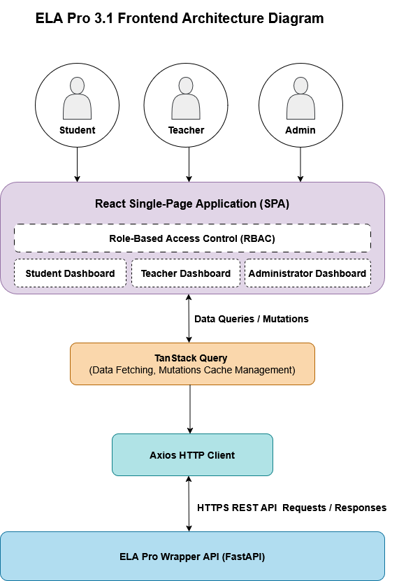
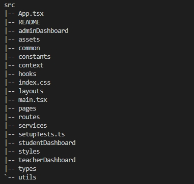

## ELA Pro 3.1 Deployment Guide 


### 1. Application Overview 

#### Purpose
ELA Pro 3.1 is an IELTS (International English Language Testing System) essay feedback platform that supports students in preparing for the written component of their IELTS Academic or General Training assessment. The application provides role-based dashboards for students, teachers and administrators, each offering functionality tailored to the needs of that user group. This deployment guide documents the frontend application developed as part of the ELA Pro 3.1 project and outlines its architecture, deployment process and handover considerations.

#### Frontend Architecture Diagram
Figure 1 illustrates the high-level frontend architecture of the ELA Pro 3.1 application and the interaction between the React single-page application, TanStack Query, Axios HTTP client, and ELA Pro Wrapper API.



*Figure 1. Frontend System Architecture Diagram*

<div style="page-break-before: always;"></div>

The frontend is implemented as a React single-page application (SPA) containing role-specific dashboards for students, teachers, and administrators. Role-based access control (RBAC) is implemented through an AuthProvider component and useAuth custom hook, which expose the application's global authentication context. The authenticated user's role is used to determine the appropriate dashboard and to enforce access restrictions on protected routes through a custom PrivateRoute component.

TanStack Query is used to manage data fetching, mutations, and client-side caching. React components interact with the query layer through useQuery and useMutation hooks, which coordinate requests and cache updates.

HTTP communication with the backend is handled through a custom Axios client. Axios sends HTTPS requests to the ELA Pro Wrapper API and returns JSON responses to the query layer, which then updates the user interface.

<div style="page-break-before: always;"></div>

### 2. Repository Structure 

Figure 2 (below) illustrates the high-level source code organisation of the frontend application. The frontend source code is organised into role-specific feature directories (studentDashboard, teacherDashboard, and adminDashboard), while shared functionality is organised into common folders such as hooks, services, types, and utils. Sub-components for individual feature areas are developed within the role-specific dashboard directories and are composed into page-level components. Page-level components are organised separately within the pages directory and grouped by functional area, including student, teacher, administrator, and authentication pages. The types directory contains shared TypeScript type definitions used throughout the application, including API request and response structures as well as component prop definitions. Centralising these definitions promotes consistency and type safety across the codebase.

The context directory contains the authentication context used to manage user state and expose role information throughout the application. The routes directory contains the application's routing configuration (AppRouter) as well as protected route components responsible for enforcing role-based access control (RBAC). Together, these modules ensure users are routed to the appropriate dashboard and can only access functionality permitted by their assigned role.

#### Folder tree structure 



*Figure 2. High-level frontend directory structure*

<div style="page-break-before: always;"></div>

### 3. Development Environment

#### 3.1 Prerequisites 

The following sofwtware must be installed prior to running the application locally:

- Node.js (developed and tested using v24.14.0.)
- npm (bundled with Node.js)
- Git 
- Visual Studio Code (recommended)

#### 3.2 Obtaining the Source Code

The frontend code is maintained in the project's GitHub repository:

Repository: `elapro3.1_cp2026`

Current URL: <a href="https://github.com/orianatj/elapro3.1_cp2026">ELA Pro Frontend Repository</a>

**Note.** Repository ownership is intended to be transferred as part of the project handover process. Consequently, the repository URL may change following transfer to the teaching team or client.

Clone the repository and navigate to the project directory:

```bash
git clone <repository-url>
cd <repository-name>
```

#### 3.3 Installing Dependencies 

The frontend application is built using React, TypeScript, Vite, TanStack Query, Axios, React Router, and Recharts. These dependencies are managed through npm and are defined within the project's `package.json` file.

To install all project dependencies, run the following command from the project root directory:

```bash
npm install
```
#### 3.4 Running the Application 

To start the Vite development server, run:

```bash
npm run dev
```
Once started, the application can be accessed through the local URL displayed in the terminal.

#### 3.5 Building the Application 
To generate a production build locally, run:

```bash
npm run build
```
This command creates an optimised production build of the application within the dist directory. 

The build can be previewed locally by running:

```bash
npm run preview
```
This starts a local server that serves the production build, allowing the application to be tested in a production-like environment prior to deployment.

**Note**: Deployment to the production environment is not performed manually and is instead managed automatically by Netlify when changes are merged into the repository's `main` branch.

<div style="page-break-before: always;"></div>

### 4. Deployment Process 

#### 4.1 Deployment Architecture

The ELA Pro frontend is hosted on Netlify and integrated with the project's GitHub repository. Deployment is managed through an automated continuous deployment workflow. Developers implement changes on feature branches and submit them for review through a pull request. Prior to merge, pull requests must satisfy the repository's branch protection rules, including successful Netlify build validation and approval from at least one reviewer. Once the pull request is merged into the main branch, Netlify automatically generates a new production build and deploys the updated application.

#### 4.2 Netlify Configuration 

The ELA Pro frontend is configured for deployment using Netlify. The current deployment configuration is summarised below:

- **Production Branch:** `main`
- **Build Command:** `npm run build`
- **Publish Directory:** `dist`
- **Branch Deployments:** `Disabled (production branch only)`
- **Deploy Previews:** `Enabled for pull requests targeting the production branch`

The project includes a `netlify.toml` configuration file located in the root directory of the repository and is automatically applied during Netlify deployments. This file contains redirect rules required for React Router client-side routing and ensures that all application routes are redirected to index.html, allowing route handling to be performed by the React application rather than the Netlify web server.

```toml
[[redirects]]
  from = "/*"
  to = "/index.html"
  status = 200
```

#### 4.3 Repository Integration 

The Netlify deployment is linked directly to the GitHub repository through Netlify's continuous deployment integration. Following repository ownership transfer, Netlify may require reauthorisation to access the repository in its new location. If automated deployments cease functioning after transfer, navigate to Site Configuration → Build & Deploy → Continuous Deployment → Repository and relink the repository as required.

<div style="page-break-before: always;"></div>

### 5. Handover Considerations 

#### 5.1 Netlify Hosting 

The frontend application is currently hosted on Netlify using the free-tier plan. Deployment management, build configuration, and site administration are performed through the Netlify dashboard. Access to the Netlify account associated with the ELA Pro project is required to manage hosting configuration and future deployments.

The Netlify account was established using a dedicated email address created specifically for the ELA Pro development team. Access credentials for this account will be provided to the teaching team as part of the project handover process.

#### 5.2 API Configuration 

The frontend communicates with the backend through a custom Axios HTTP client located in:

`src/services/client.ts`

The current API base URL is:

`https://ela-pro.duckdns.org/api/v1`

Should the backend API endpoint change, the base URL must be updated within the Axios configuration before rebuilding and redeploying the application.