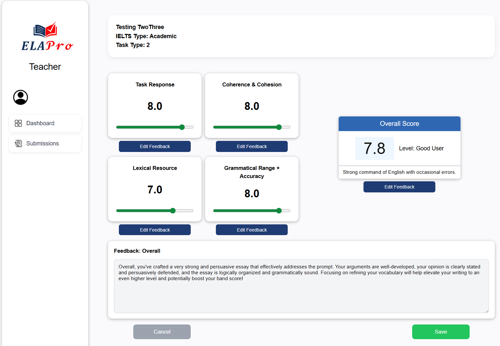

# ELA Pro 3.1 User Guide

## Introduction

---

## Getting Started

--- 

## Navigation 

---

## Student Features 

### Feature X

---

## Teacher Features 

### Individual Submission

The Individual Submission page allows teachers to view and assess individual student essay submissions. Teachers can access detailed submission information, review the student's essay content, and provide feedback or scores.

*Figure 1. Individual Submission Page Interface*

To access the Individual Submission page:
1. Navigate to the Teacher Dashboard
2. Select the 'Submissions' tab on the navigation bar
3. Click on a student's submission in the list to view that specific submission

The page displays the student's essay text, submission metadata (including word count), the AI generated scores and feedback for each criterion, and provides options for the teacher to edit the feedback and scores.

---

### Edit Student Score

The Edit Student Score page enables teachers to modify or update scores for student submissions. This feature allows teachers to correct scoring errors or adjust grades based on reassessment.

*Figure 2. Edit Student Score Page Interface*

To edit a student's score:
1. Navigate to the Teacher Dashboard
2. Select the appropriate class and student
3. Click the "Edit Score" button on the submission
4. Update the score fields as needed
5. Save the changes

The page provides input fields for each scoring criterion, allowing teachers to adjust individual component scores and automatically recalculate the total score.

### Feature X

---

## Admin Features

### Feature X 

---