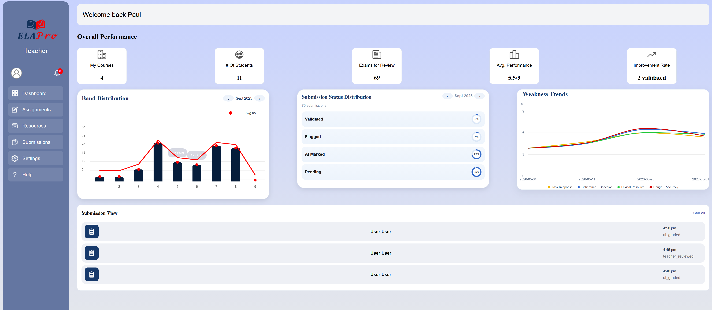

# ELA Pro 3.1 User Guide

## Introduction

---

## Getting Started

--- 

## Navigation 

---

## Student Features 

### Feature X

---

## Teacher Features 

### Individual Submission View

The Individual Submission View page allows teachers to view an overall assessment of a student's individual essay submission. Teachers can access detailed submission information, review the student's essay content, and review the AI generated feedback and scores.

To access the Individual Submission View page:
1. Navigate to the Teacher Dashboard
2. Select the 'Submissions' tab on the navigation bar
3. Click on a student's submission in the list to view that specific submission

The page displays the student's essay text, submission metadata, the AI generated scores and feedback for each criterion, and provides options for the teacher to edit the feedback and scores or return back to the submissions list.
First presented on screen is the student's essay question, student response, and submission metadata.

Underneath the response is where the submission metadata is displayed, including word count and submission date.

Next, the AI generated scores and feedback for each criterion are displayed. The scores and feedback are separated by competency. 
Additionally, these scores and feedback are editable by the teacher by selecting the 'Edit Grade' button underneath the overall score to open the Edit Student Score page.
To return to the submissions list, click the 'OK' button.

### Edit Student Score

The Edit Student Score page enables teachers to modify or update scores for student submissions. This feature allows teachers to correct scoring errors or adjust grades based on reviews for reassessment.

To access the Edit Student Score page:
1. Navigate to the Teacher Dashboard
2. Select the 'Submissions' tab on the navigation bar
3. Click on a student's submission in the list to view that specific submission
4. Select the 'Edit Grade' button underneath the overall score to open the Edit Student Score page.

The top of page displays the student's name, the IELTS type, and task type of the submission. 

Below this, the current score and feedback for each criterion are displayed, allowing teachers to adjust individual component scores and automatically recalculate the total score.
Each competency scorebox has an adjustable slider that allows each criterion's score to be adjusted. Adjusting a score will automatically update the overall score.
Additionally, underneath each scorebox is an 'edit feedback' button that allows teachers to edit the feedback for that criterion.
Clicking this button will change what feedback type is displayed in the textbox below the scores. This is an editable textbox where the teacher can edit the feedback for that criterion.

When all scores and feedback have been adjusted to the teacher's liking, the teacher can click the 'Save' button to save the changes to the database. 
There will be a confirmation dialog that will let the teacher know that the changes have been saved. Clicking 'OK' will take the user back to the Individual Submission View page.

### Navigation
Navigation is done via the side bar WHich is split up into theese navigational components:
1. Dashboard -> Homepage
2. Alert icon -> Notifications
3. Submissions -> View Submissions
Clicking on one of theese icons will simply navigate to that section

### HomePage
The homepage allows teachers to navigate and view main stastics. View the three most recent student submissions and get a detailed overview of charts.

*Figure 1. Homepage page interface*

#### Band Distrubution Chart
This chart tracks the average band distrubution over different areas, tracking the average percentage of each band and overall average point.

#### Submission Status Distrubution
This status distrubution chart showcases validated, flagged, AI marked, Pending 

##### Weakness Trends
This graph weakness trends of all 4 grading categorgies. This graph is interactable and the elements in the legend can be tracked.

1. The legend at the bottom has clickable elements
2. Clicking one it will turn grey and the graph will no longer show that element
3. You can click multiple of theese elements to turn them off
4. Clicking a element that is off will be on again.
5. Hovering over the graph will showcase values 

##### Submission View
This view showcases the three most recent student submissions. This has basic navigation functionality.
1. Click one of the items in the list 
2. Will navigate to the most recent student submission 

### View Submissions Page
This page displays in table format various different submissions from students. It displays the Name, IELTS Type, task type, status and submission time.

*Figure 2. Submission page interface*

#### Sort By
This button allows the user to sort by either name or date
1. When you click the sort by button a drop down button will appear
2. When you click either name or date it will update table auomatically
3. To switch either to other option or default click button again then change accordingly

#### Filter
This button Allows filter by IELTS Type, Task type or status.
1. When You click by the button a drop down button will come up
2. This will display three options allowing to sort by IELTS Type, Task Task and statuses
3. Click on one of theese options will have another drop down which you can select from the various options
4. Once clicked the table wil automatically update to showcase representing the nee filtered options
5. Other filter options can be added via the same process in which it will display accordingly
6. To remove just click on the filter that was triggered and select show all
7. Once filter is clicked again the drop down selection will be removed 

---

## Admin Features

### Feature X 

---