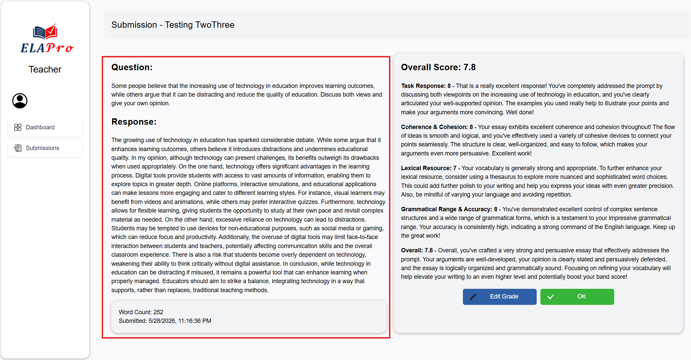
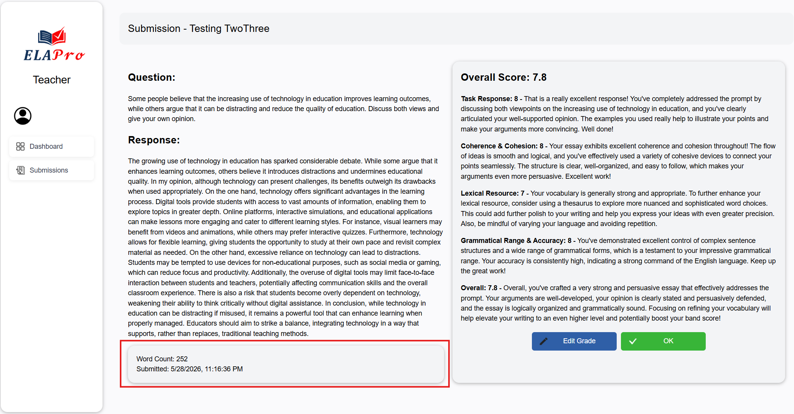

# ELA Pro 3.1 User Guide

## Introduction

---

## Getting Started

--- 

## Navigation 

---

## Student Features 

### Feature X

---

## Teacher Features 

### Individual Submission View

The Individual Submission View page allows teachers to view an overall assessment of a student's individual essay submission. Teachers can access detailed submission information, review the student's essay content, and review the AI generated feedback and scores.

To access the Individual Submission View page:
1. Navigate to the Teacher Dashboard
2. Select the 'Submissions' tab on the navigation bar
3. Click on a student's submission in the list to view that specific submission

The page displays the student's essay text, submission metadata, the AI generated scores and feedback for each criterion, and provides options for the teacher to edit the feedback and scores or return back to the submissions list.
First presented on screen is the student's essay question, student response, and submission metadata.

Underneath the response is where the submission metadata is displayed, including word count and submission date.

Next, the AI generated scores and feedback for each criterion are displayed. The scores and feedback are separated by competency. 
Additonally, these scores and feedback are editable by the teacher by selecting the 'Edit Grade' button underneath the overall score to open the Edit Student Score page.
To return to the submissions list, click the 'OK' button.

---

### Edit Student Score

The Edit Student Score page enables teachers to modify or update scores for student submissions. This feature allows teachers to correct scoring errors or adjust grades based on reassessment.

*Figure 2. Edit Student Score Page Interface*

To edit a student's score:
1. Navigate to the Teacher Dashboard
2. Select the appropriate class and student
3. Click the "Edit Score" button on the submission
4. Update the score fields as needed
5. Save the changes

The page provides input fields for each scoring criterion, allowing teachers to adjust individual component scores and automatically recalculate the total score.

### Feature X

---

## Admin Features

### Feature X 

---